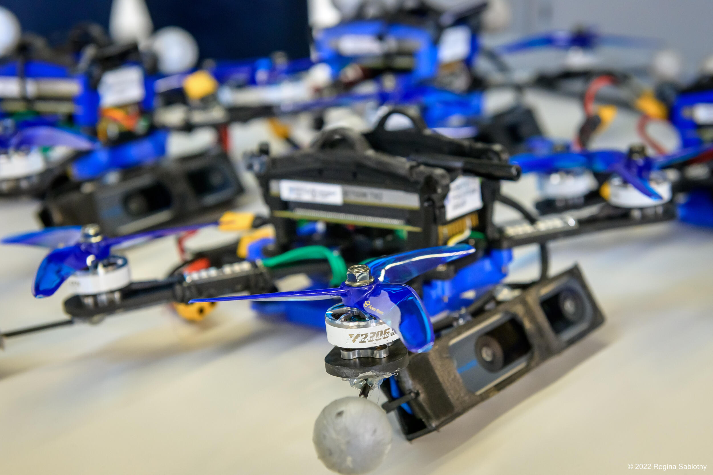

#################
Hardware Overview
#################

The Agilicious Platform consits of the following main components:
  - :code:`Nvidia Jetson TX2`: Main compute unit
  - :code:`ConnectTech Quasar`: Breakout Board
  - :code:`TMotor F7 Flight Controller`: Low-Level Controller
  - :code:`F55A Pro II 3-6S 4-in-1 ESC`: Electronic Speed Controller
  - :code:`Armattan Chameleon 6"`: Main Plate
  - :code:`TMotor Veloc V2306 V2.0`: Motors
  - :code:`Azure Power SFP 5148`: Propeller
  - :code:`Tattu R-Line 4s 1800mAh 120C`: Battery

